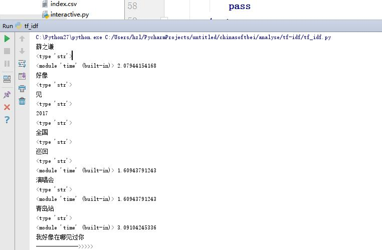
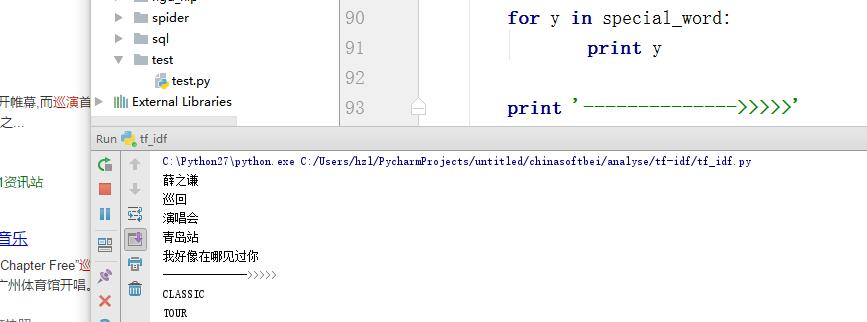

# 事件热度分析算法
- 数学公式:hot_num= math.log(100000000/int(num))
###原理解析
[Test.md](/Test.md)
- 捉取百度搜索引擎返回来的结果数，通过 math.log(100000000/int(num) 这数学公式获取热度，因为分词后词词出现的次数越大，结果越小，那么这个就是关键字
> 算法实现如下
```python
def get_num(title):
    driver.get(url)
    driver.find_element_by_id('kw').send_keys(title)
    driver.find_element_by_id('su').click()
    time.sleep(3)
    bsobj=BeautifulSoup(driver.page_source,'html.parser')
    div=bsobj.find('div',class_='nums').get_text().encode("utf-8")
    print type(div)
    num=re.findall(r'约(.*)个$',div)[0]
    num=num.replace(',','')
    hot_num= math.log(100000000/int(num)) 
```
> 运行效果图



# 关键字提取算法
- 所需工具:本地化nlp分词模块
> 导入模块并分词代码实现
```python 
from pyltp import Segmentor
segmentor = Segmentor()
segmentor.load(r'C:\Users\hzl\PycharmProjects\untitled\chinasoftbei\analyse\ltp_data\cws.model')  # 分句模型
words = segmentor.segment(x)  #分词
```
- 将分好的词放到百度搜索引擎中获取搜素结果
> 代码实现
```python
'''
这个是对标题进行分词的模块
方法接收一个参数，就是待分词的csv地址
采用本地分词，效率高
顺便加强了分词效果，像一些专用名词，我们不会对其进行拆解
'''
def fenci(address):
    stopwords = {}.fromkeys([line.rstrip() for line in open('tingyongci')])  # 去掉停用词
    segmentor = Segmentor()
    segmentor.load(r'C:\Users\hzl\PycharmProjects\untitled\chinasoftbei\analyse\ltp_data\cws.model')  # 分句模型
    df = pd.read_csv(address)
    titles = list(df['标题'].head(30))
    f=open('tf_idf.txt','a')

    #将专用名词提取出来，像被'《》，“”，【】'等符号包括的
    for x in titles:
        special_word=[]
        try:
            kw= re.findall(r'“(.*)”',x)[0]
            special_word.append(kw)
        except Exception as e:
            pass
        try:
            kw= re.findall(r'《(.*)》',x)[0]
            special_word.append(kw)
        except Exception as e:
            pass
        try:
            kw= re.findall(r'【(.*)】',x)[0]
            special_word.append(kw)
        except Exception as e:
            pass
        try:
            kw=re.findall(r'[(.*)]',x)[0]
            special_word.append(kw)
        except Exception as e:
            pass


        words = segmentor.segment(x)  #分词
        for x in words:
            # 去掉停用词

            if x not in stopwords:
                print x
                get_num(str(x).decode('utf8'))
        for y in special_word:
                print y

        print '-------------->>>>>'
```
> 关键字提取效果图



##细节优化
- 分词模块会把句子中所有字词进行拆分，这就导致一些专用名词也被拆分，要想这些专用名词不被拆分，有好多实现的方法，本文使用的方法是正则匹配，实现了了一些符号中的字词被保留，如“<font color="red""><>，“”，[]</font>”等等
> 部分代码实现
```python
        try:
            kw= re.findall(r'“(.*)”',x)[0]
            special_word.append(kw)
        except Exception as e:
            pass
        try:
            kw= re.findall(r'《(.*)》',x)[0]
            special_word.append(kw)
        except Exception as e:
            pass
        try:
            kw= re.findall(r'【(.*)】',x)[0]
            special_word.append(kw)
        except Exception as e:
            pass
        try:
            kw=re.findall(r'[(.*)]',x)[0]
            special_word.append(kw)
        except Exception as e:
            pass
```